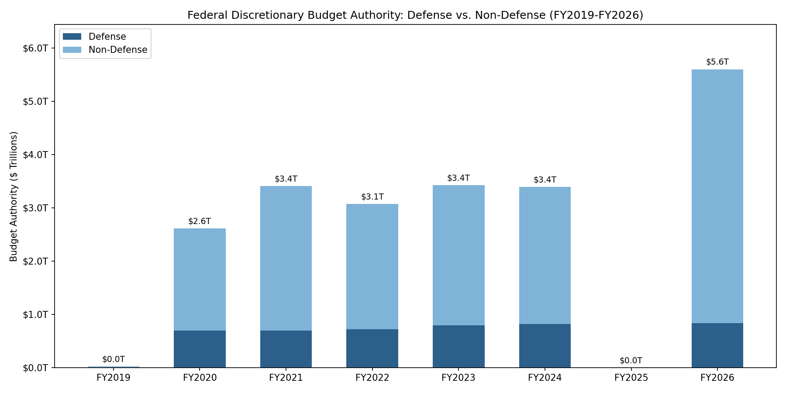
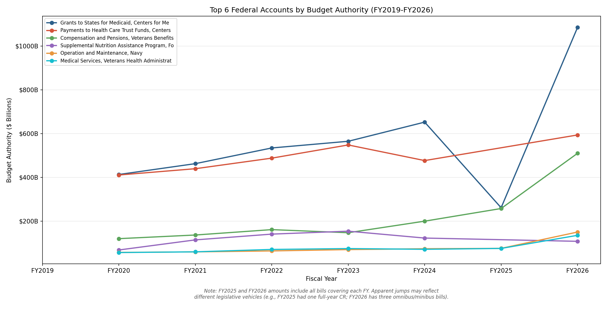
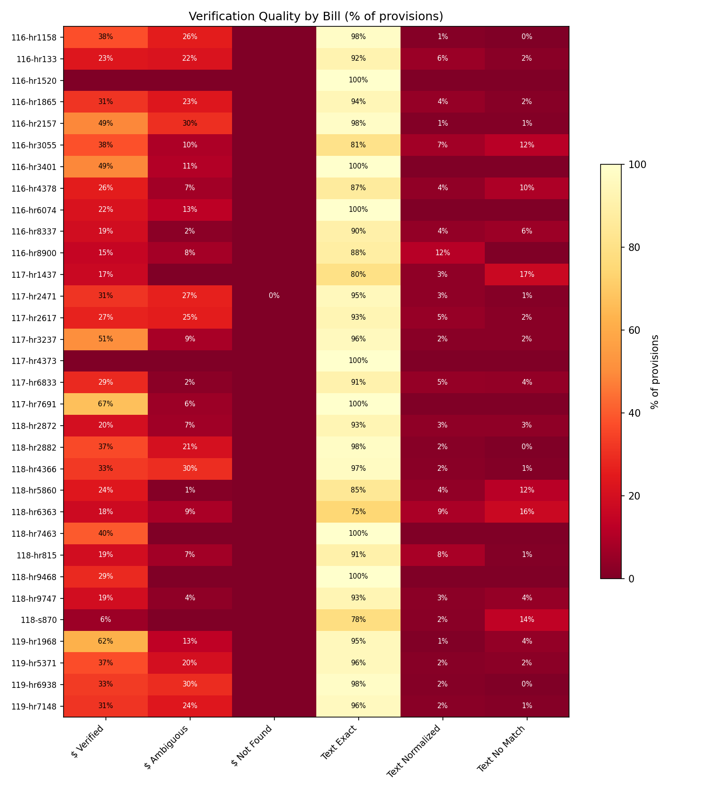

# Recipes & Demos

Real questions, real commands, real output — all from the included 32-bill dataset. Every recipe runs against the `data/` directory with **no API keys** unless noted. Copy-paste and go.

> **Run all demos yourself:** The `book/cookbook/cookbook.py` script generates all CSVs, charts, and JSON shown on this page. See [Run All Demos Yourself](#run-all-demos-yourself) at the bottom.

---

## What's in the Dataset

| | |
|---|---|
| **116th Congress** (2019–2021) | 11 bills — FY2019, FY2020, FY2021 |
| **117th Congress** (2021–2023) | 7 bills — FY2021, FY2022, FY2023 |
| **118th Congress** (2023–2025) | 10 bills — FY2024, FY2025 |
| **119th Congress** (2025–2027) | 4 bills — FY2025, FY2026 |
| **Total** | **32 bills, 34,568 provisions, $21.5 trillion in budget authority** |
| **Accounts tracked** | 1,051 unique Federal Account Symbols across 937 cross-bill links |
| **Source traceability** | 100% — every provision has exact byte positions in the enrolled bill |
| **Dollar verification** | 99.995% — 18,583 of 18,584 dollar amounts confirmed in source text |

### Subcommittee coverage by fiscal year

The `--subcommittee` filter works for fiscal years where Congress passed traditional omnibus or minibus bills with separate divisions per jurisdiction. FY2025 was funded through H.R. 1968, a full-year [continuing resolution](../reference/glossary.md) that wraps all 12 subcommittees into a single division — so `--subcommittee` cannot break it apart. Use `trace` or `search --fy 2025` to access FY2025 data by account.

| Fiscal Year | Subcommittee filter | Why |
|---|---|---|
| FY2019 | Partial | Only supplemental and disaster relief bills |
| FY2020–FY2024 | ✅ Full | Traditional omnibus/minibus bills with per-subcommittee divisions |
| FY2025 | ❌ Not available | Funded via full-year CR (H.R. 1968) — all jurisdictions in one division |
| FY2026 | ✅ Full | Three bills cover all 12 subcommittees |

---

## Quick Reference — 5 Commands, No Explanation Needed

```bash
# Track any federal account across all fiscal years (by FAS code or name search)
congress-approp trace "child nutrition" --dir data

# See FY2026 budget totals by bill
congress-approp summary --dir data --fy 2026

# Find FEMA provisions across all bills
congress-approp search --dir data --keyword "Federal Emergency Management" --fy 2026

# Compare THUD funding FY2024 → FY2026 with inflation adjustment
congress-approp compare --base-fy 2024 --current-fy 2026 --subcommittee thud --dir data --use-authorities --real

# Audit verification quality across all 32 bills
congress-approp audit --dir data
```

---

## For Journalists

### Recipe 0: Find anything by keyword — no setup needed

**Question:** *"What did Congress fund for veterans?"*

The simplest possible search — one keyword, no API keys, no setup:

```bash
congress-approp search --dir data --keyword "veterans" --type appropriation
```

```text
┌───┬───────────┬───────────────┬───────────────────────────────────────────────┬─────────────────┬─────────┬─────┐
│ $ ┆ Bill      ┆ Type          ┆ Description / Account                         ┆      Amount ($) ┆ Section ┆ Div │
╞═══╪═══════════╪═══════════════╪═══════════════════════════════════════════════╪═════════════════╪═════════╪═════╡
│ ✓ ┆ H.R. 133  ┆ appropriation ┆ Compensation and Pensions                     ┆   6,110,251,552 ┆         ┆ J   │
│ ✓ ┆ H.R. 133  ┆ appropriation ┆ Readjustment Benefits                         ┆  14,946,618,000 ┆         ┆ J   │
│ ✓ ┆ H.R. 133  ┆ appropriation ┆ General Operating Expenses, Veterans Benefit… ┆   3,180,000,000 ┆         ┆ J   │
│ ...                                                                                                              │
```

The `--keyword` flag searches the `raw_text` field — the verbatim bill language stored with each provision. It's case-insensitive. Combine with `--type` to narrow by provision type, `--fy` to narrow by fiscal year, `--agency` to narrow by department, or `--min-dollars` / `--max-dollars` for dollar ranges. All filters are ANDed together.

For a full explanation of every column and symbol in this table, see [Recipe 3](#recipe-3-find-funding-by-topic--keyword-and-semantic-search) below.

---

### Recipe 1: Track any program across all fiscal years

**Question:** *"How has Child Nutrition funding changed since FY2020?"*

The `trace` command follows a single federal account across every bill in the dataset using its [Federal Account Symbol](../reference/glossary.md) (FAS code) — a stable government-assigned identifier that persists through name changes and reorganizations.

**Step 1:** Find the FAS code by name:

```bash
congress-approp trace "child nutrition" --dir data
```

If the name matches multiple accounts, the tool lists them:

```text
Multiple authorities match "child nutrition". Be more specific or use the FAS code:

  012-2903 — McGovern-Dole International Food for Education and Child Nu…
  012-3510 — Special Supplemental Nutrition Program for Women, Infants, …
  012-3539 — Child Nutrition Programs, Food and Nutrition Service, Agric…
```

**Step 2:** Use the FAS code for the exact account:

```bash
congress-approp trace 012-3539 --dir data
```

```text
TAS 012-3539: Child Nutrition Programs, Food and Nutrition Service, Agriculture
  Agency: Department of Agriculture

┌──────┬──────────────────────┬───────────┬──────────────────────────┐
│ FY   ┆ Budget Authority ($) ┆ Bill(s)   ┆ Account Name(s)          │
╞══════╪══════════════════════╪═══════════╪══════════════════════════╡
│ 2020 ┆       23,615,098,000 ┆ H.R. 1865 ┆ Child Nutrition Programs │
│ 2021 ┆       25,118,440,000 ┆ H.R. 133  ┆ Child Nutrition Programs │
│ 2022 ┆       26,883,922,000 ┆ H.R. 2471 ┆ Child Nutrition Programs │
│ 2023 ┆       28,545,432,000 ┆ H.R. 2617 ┆ Child Nutrition Programs │
│ 2024 ┆       33,266,226,000 ┆ H.R. 4366 ┆ Child Nutrition Programs │
│ 2026 ┆       37,841,674,000 ┆ H.R. 5371 ┆ Child Nutrition Programs │
└──────┴──────────────────────┴───────────┴──────────────────────────┘

  6 fiscal years, 6 bills, 175,270,792,000 total
```

**Reading the output:**

| Column | Meaning |
|---|---|
| **FY** | Federal fiscal year (Oct 1 – Sep 30). FY2024 = Oct 2023 – Sep 2024. |
| **Budget Authority ($)** | What Congress authorized the agency to obligate (sign contracts, award grants). This is [budget authority](../reference/glossary.md), not outlays (actual cash disbursed). |
| **Bill(s)** | The enacted legislation that provided the funding. `(CR)` means a continuing resolution; `(supplemental)` means emergency/supplemental funding. |
| **Account Name(s)** | The account name as written in each bill. May vary across congresses — the FAS code (`012-3539`) is the stable identifier. |

**The story:** Child Nutrition grew 60% from $23.6B (FY2020) to $37.8B (FY2026). FY2025 is absent because H.R. 1968 (the full-year CR) continued FY2024 rates without a separate line item.

**Accounts with name changes** show the power of TAS-based tracking:

```bash
congress-approp trace 070-0400 --dir data
```

```text
TAS 070-0400: Operations and Support, United States Secret Service, Homeland Security
  Agency: Department of Homeland Security

┌──────┬──────────────────────┬────────────────┬─────────────────────────────────────────────┐
│ FY   ┆ Budget Authority ($) ┆ Bill(s)        ┆ Account Name(s)                             │
╞══════╪══════════════════════╪════════════════╪═════════════════════════════════════════════╡
│ 2020 ┆        2,336,401,000 ┆ H.R. 1158      ┆ United States Secret Service—Operations an… │
│ 2021 ┆        2,373,109,000 ┆ H.R. 133       ┆ United States Secret Service—Operations an… │
│ 2022 ┆        2,554,729,000 ┆ H.R. 2471      ┆ Operations and Support                      │
│ 2023 ┆        2,734,267,000 ┆ H.R. 2617      ┆ Operations and Support                      │
│ 2024 ┆        3,007,982,000 ┆ H.R. 2882      ┆ Operations and Support                      │
│ 2025 ┆          231,000,000 ┆ H.R. 9747 (CR) ┆ United States Secret Service—Operations an… │
└──────┴──────────────────────┴────────────────┴─────────────────────────────────────────────┘

  Name variants across bills:
    "Operations and Support" (117-hr2471, 117-hr2617, 118-hr2882) [prefix]
    "United States Secret Service—Operations and Sup…" (116-hr1158, 116-hr133, 118-hr9747) [canonical]

  6 fiscal years, 6 bills, 13,237,488,000 total
```

The account was renamed between the 116th and 117th Congress — the "United States Secret Service—" prefix was dropped. The FAS code `070-0400` unifies both names automatically. The FY2025 row shows $231M from H.R. 9747, a CR supplement — not the full-year level.

---

### Recipe 2: Find the biggest funding changes — with inflation adjustment

**Question:** *"What got the biggest increases and cuts in transportation and housing?"*

```bash
congress-approp compare --base-fy 2024 --current-fy 2026 --subcommittee thud \
    --dir data --use-authorities --real
```

**What the flags mean:**

| Flag | Purpose |
|---|---|
| `--base-fy 2024` | Use all bills covering FY2024 as the baseline |
| `--current-fy 2026` | Use all bills covering FY2026 as the comparison |
| `--subcommittee thud` | Scope to the Transportation, Housing and Urban Development jurisdiction. The tool automatically resolves which division in each bill corresponds to THUD. |
| `--use-authorities` | Match accounts across bills using Treasury Account Symbols instead of name strings. This handles renames and agency reorganizations. |
| `--real` | Add inflation-adjusted columns using CPI data. Shows whether a nominal increase actually beat inflation. |

```text
20 orphan(s) rescued via TAS authority matching
Comparing: H.R. 4366 (118th)  →  H.R. 7148 (119th)

┌─────────────────────────────────────┬──────────────────────┬────────────────┬────────────────┬─────────────────┬─────────┬───────────┬───┬──────────┐
│ Account                             ┆ Agency               ┆       Base ($) ┆    Current ($) ┆       Delta ($) ┆     Δ % ┆ Real Δ %* ┆   ┆ Status   │
╞═════════════════════════════════════╪══════════════════════╪════════════════╪════════════════╪═════════════════╪═════════╪═══════════╪═══╪══════════╡
│ Tenant-Based Rental Assistance      ┆ Department of Housi… ┆ 32,386,831,000 ┆ 38,438,557,000 ┆  +6,051,726,000 ┆  +18.7% ┆    +13.8% ┆ ▲ ┆ changed  │
│ Federal-Aid Highways                ┆ Federal Highway Adm… ┆ 60,834,782,888 ┆ 63,396,105,821 ┆  +2,561,322,933 ┆   +4.2% ┆     -0.1% ┆ ▼ ┆ changed  │
│ Operations                          ┆ Federal Aviation Ad… ┆ 12,729,627,000 ┆ 13,710,000,000 ┆    +980,373,000 ┆   +7.7% ┆     +3.2% ┆ ▲ ┆ changed  │
│ Facilities and Equipment            ┆ Federal Aviation Ad… ┆  3,191,250,000 ┆  4,000,000,000 ┆    +808,750,000 ┆  +25.3% ┆    +20.1% ┆ ▲ ┆ changed  │
│ Capital Investment Grants           ┆ Federal Transit Adm… ┆  2,205,000,000 ┆  1,700,000,000 ┆    -505,000,000 ┆  -22.9% ┆    -26.1% ┆ ▼ ┆ changed  │
│ Public Housing Fund                 ┆ Department of Housi… ┆  8,810,784,000 ┆  8,319,393,000 ┆    -491,391,000 ┆   -5.6% ┆     -9.5% ┆ ▼ ┆ changed  │
│ ...                                 ┆                      ┆                ┆                ┆                 ┆         ┆           ┆   ┆          │
```

**Reading the output:**

| Column | Meaning |
|---|---|
| **Account** | The appropriations account name, matched between the two fiscal years |
| **Agency** | The parent department or agency that owns the account |
| **Base ($)** | Total budget authority for this account in FY2024. Budget authority = what Congress authorized, not what was spent. |
| **Current ($)** | Total budget authority for this account in FY2026 |
| **Delta ($)** | Current minus Base. Positive = increase, negative = cut. |
| **Δ %** | Nominal percentage change (not adjusted for inflation) |
| **Real Δ %\*** | Inflation-adjusted percentage change using CPI-U data. The asterisk reminds you this is a computed value, not a number from the bill text. |
| **▲ / ▼ / —** | Quick visual: ▲ = real increase (beat inflation), ▼ = real cut or inflation erosion, — = unchanged |
| **Status** | `changed` = account in both FYs with different amounts. `unchanged` = same amount. `only in base` = account not in FY2026. `only in current` = new account in FY2026. `matched (TAS …) (normalized)` = matched via Treasury Account Symbol because the name differed between bills. |

**Key insight:** Federal-Aid Highways shows a **nominal** increase of +4.2%, but the **real** (inflation-adjusted) change is -0.1% — a flat-line disguised as a raise. Without `--real`, you'd report an increase that doesn't exist in purchasing power.

> **Inflation adjustment:** Add `--real` to any `compare` command to see inflation-adjusted percentage changes using bundled CPI-U data. **▲** = real increase (beat inflation). **▼** = real cut or inflation erosion. The `Real Δ %*` column asterisk reminds you this is computed from a price index, not a number verified against the bill text. Works on any subcommittee or fiscal year pair — no API key needed.

The "20 orphan(s) rescued via TAS authority matching" message means 20 accounts that would have appeared as unmatched (different names between FY2024 and FY2026) were successfully paired using their FAS codes.

---

### Recipe 3: Find funding by topic — keyword and semantic search

**Question:** *"How much did Congress give FEMA this year?"*

**Keyword search (no API key needed):**

```bash
congress-approp search --dir data --keyword "Federal Emergency Management" --fy 2026
```

```text
┌───┬───────────┬────────────────────┬───────────────────────────────────────────────┬────────────────┬───────────┬─────┐
│ $ ┆ Bill      ┆ Type               ┆ Description / Account                         ┆     Amount ($) ┆ Section   ┆ Div │
╞═══╪═══════════╪════════════════════╪═══════════════════════════════════════════════╪════════════════╪═══════════╪═════╡
│ ✓ ┆ H.R. 1968 ┆ appropriation      ┆ Federal Emergency Management Agency—Federa…   ┆  3,203,262,000 ┆ SEC. 1701 ┆ A   │
│ ✓ ┆ H.R. 1968 ┆ appropriation      ┆ Federal Emergency Management Agency—Disast…   ┆ 22,510,000,000 ┆ SEC. 1701 ┆ A   │
│ ✓ ┆ H.R. 1968 ┆ rescission         ┆ Federal Emergency Management Agency—Operat…   ┆      1,723,000 ┆ SEC. 1706 ┆ A   │
│   ┆ H.R. 1968 ┆ transfer_authority ┆                                               ┆              — ┆ SEC. 1708 ┆ A   │
│   ┆ H.R. 5371 ┆ rider              ┆ FEMA Disaster Relief Fund amounts may be app… ┆              — ┆ SEC. 147  ┆ A   │
│ ≈ ┆ H.R. 815  ┆ appropriation      ┆ Federal Emergency Management Agency—Operat…   ┆     10,000,000 ┆           ┆ A   │
│ ✓ ┆ H.R. 815  ┆ appropriation      ┆ Federal Emergency Management Agency—Federa…   ┆    390,000,000 ┆           ┆ A   │
└───┴───────────┴────────────────────┴───────────────────────────────────────────────┴────────────────┴───────────┴─────┘
7 provisions found
```

**Reading the output:**

| Column | Meaning |
|---|---|
| **$** | Dollar amount verification status. **✓** = the exact dollar string (e.g. `$22,510,000,000`) was found at one unique position in the [enrolled](../reference/glossary.md) bill text — highest confidence. **≈** = found at multiple positions (common for round numbers) — amount is correct but location is ambiguous. **✗** = not found in source — needs review. Blank = provision has no dollar amount (riders, directives, transfer authorities). |
| **Bill** | The enacted legislation this provision comes from |
| **Type** | Provision classification: `appropriation` (grant of [budget authority](../reference/glossary.md)), `rescission` (cancellation of prior funds), `transfer_authority` (permission to move funds between accounts), `rider` (policy provision with no direct spending), `directive` (reporting requirement), `limitation` (spending cap), `cr_substitution` ([CR](../reference/glossary.md) anomaly replacing one dollar amount with another), and others |
| **Description / Account** | The account name (for appropriations, rescissions) or a description (for riders, directives). This is the name as written in the bill text, between `''` delimiters. |
| **Amount ($)** | The dollar amount. Shows **—** for provisions without a dollar value. This is *budget authority* — what Congress authorized, not what the Treasury will disburse. |
| **Section** | The section reference in the bill (e.g., `SEC. 1701`). Empty if the provision appears under a heading without a numbered section. |
| **Div** | Division letter for omnibus/minibus bills (e.g., `A` for Division A). Bills without divisions show blank. Division letters are bill-internal — Division A means different things in different bills. |

**Semantic search (requires `OPENAI_API_KEY`):**

When you don't know the official program name, semantic search finds provisions by *meaning*:

```bash
export OPENAI_API_KEY="your-key"
congress-approp search --dir data --semantic "school lunch programs for kids" --top 3
```

```text
┌──────┬───────────────────┬───────────────┬──────────────────────────┬────────────────┐
│ Sim  ┆ Bill              ┆ Type          ┆ Description / Account    ┆     Amount ($) │
╞══════╪═══════════════════╪═══════════════╪══════════════════════════╪════════════════╡
│ 0.52 ┆ H.R. 1865 (116th) ┆ appropriation ┆ Child Nutrition Programs ┆ 23,615,098,000 │
│ 0.51 ┆ H.R. 4366 (118th) ┆ appropriation ┆ Child Nutrition Programs ┆ 33,266,226,000 │
│ 0.51 ┆ H.R. 2471 (117th) ┆ appropriation ┆ Child Nutrition Programs ┆ 26,883,922,000 │
└──────┴───────────────────┴───────────────┴──────────────────────────┴────────────────┘
```

The query "school lunch programs for kids" has **zero keyword overlap** with "Child Nutrition Programs" — yet it's the top result. The **Sim** column shows cosine similarity between the query embedding and each provision's embedding:

| Sim Score | Interpretation |
|---|---|
| > 0.80 | Almost certainly the same program (when comparing provisions) |
| 0.60–0.80 | Related topic, same policy area |
| 0.45–0.60 | Loosely related |
| < 0.45 | Probably not meaningfully related |

A score of 0.52 means "loosely related" — but in a dataset of 34,568 provisions, being the top match at 0.52 is a strong signal. Scores reflect the full provision text (account name + agency + raw bill language), not just the account name, which is why even good matches are often in the 0.45–0.55 range. Semantic search makes one API call (~100ms, fractions of a cent) to embed your query text; all comparison is local.

**More semantic search examples** (all tested against the dataset):

| Query | Top Result | Sim | What It Found |
|---|---|---|---|
| opioid crisis drug treatment | Substance Abuse Treatment | 0.48 | HHS substance abuse programs |
| space exploration | Exploration (NASA) | 0.57 | NASA Exploration account |
| military pay raises for soldiers | Military Personnel, Army | 0.53 | Army military personnel |
| fighting wildfires | Wildland Fire Management | 0.53 | Forest Service fire programs |
| veterans mental health | VA mental health counseling directives | 0.53 | VA reporting requirements |

---

## For Staffers

### Recipe 4: Subcommittee scorecard across fiscal years

**Question:** *"What's the trend for each of the 12 subcommittees?"*

```bash
# Defense
congress-approp summary --dir data --fy 2020 --subcommittee defense --format json
# ... repeat for each FY and subcommittee
```

Or use the Python script (`book/cookbook/cookbook.py`) which runs all combinations automatically. Here's the output:

| Subcommittee | FY2020 | FY2021 | FY2022 | FY2023 | FY2024 | FY2026 | Change |
|---|---|---|---|---|---|---|---|
| Defense | $693B | $695B | $723B | $791B | $819B | $836B | +21% |
| Labor-HHS | $1,089B | $1,167B | $1,305B | $1,408B | $1,435B | $1,729B | +59% |
| THUD | $97B | $87B | $112B | $162B | $184B | $183B | +88% |
| MilCon-VA | $256B | $272B | $316B | $332B | $360B | $495B | +94% |
| Homeland Security | $73B | $75B | $81B | $85B | $88B | — | +20% |
| Agriculture | $120B | $205B | $197B | $212B | $187B | $177B | +48% |
| CJS | $84B | $81B | $84B | $89B | $88B | $88B | +5% |
| Energy & Water | $50B | $53B | $57B | $61B | $63B | $69B | +38% |
| Interior | $37B | $37B | $39B | $45B | $40B | $40B | +7% |
| State-Foreign Ops | $56B | $62B | $59B | $61B | $62B | $53B | -6% |
| Financial Services | $37B | $38B | $39B | $41B | $40B | $41B | +11% |
| Legislative Branch | $5B | $5B | $6B | $7B | $7B | $7B | +43% |

FY2025 is shown as "—" for individual subcommittees because it was funded through a full-year CR (H.R. 1968) with all subcommittees under one division — see the [coverage note](#subcommittee-coverage-by-fiscal-year) above. All FY2025 spending data is still accessible via `trace` (by account) or `search --fy 2025` (unscoped).

**Reading the values:** All values are [budget authority](../reference/glossary.md) — what Congress authorized agencies to obligate. These include mandatory spending programs that appear as appropriation lines (e.g., SNAP at $107B under Agriculture, Medicaid under Labor-HHS). The "Change" column shows the percentage change from the first available year to the last.

> **Important:** The MilCon-VA number ($495B for FY2026) includes $394B in **advance appropriations** — money enacted now but available in FY2027+. See Recipe 5 for how to separate this.

---

### Recipe 5: Separate advance from current-year spending

**Question:** *"How much of the FY2026 VA budget is really for this year?"*

```bash
congress-approp summary --dir data --fy 2026 --subcommittee milcon-va --show-advance
```

```text
┌───────────────────┬──────┬────────────────┬────────────┬─────────────────┬─────────────────┬─────────────────┬─────────────────┬─────────────────┐
│ Bill              ┆ FYs  ┆ Classification ┆ Provisions ┆     Current ($) ┆     Advance ($) ┆    Total BA ($) ┆ Rescissions ($) ┆      Net BA ($) │
╞═══════════════════╪══════╪════════════════╪════════════╪═════════════════╪═════════════════╪═════════════════╪═════════════════╪═════════════════╡
│ H.R. 5371 (119th) ┆ 2026 ┆ Minibus        ┆        263 ┆ 101,839,976,450 ┆ 393,592,053,000 ┆ 495,432,029,450 ┆  16,499,000,000 ┆ 478,933,029,450 │
│ TOTAL             ┆      ┆                ┆        263 ┆ 101,839,976,450 ┆ 393,592,053,000 ┆ 495,432,029,450 ┆  16,499,000,000 ┆ 478,933,029,450 │
└───────────────────┴──────┴────────────────┴────────────┴─────────────────┴─────────────────┴─────────────────┴─────────────────┴─────────────────┘
```

**Reading the output:**

| Column | Meaning |
|---|---|
| **Bill** | Bill identifier with congress number in parentheses |
| **FYs** | Fiscal years this bill covers |
| **Classification** | Bill type. `Minibus` = a few of the twelve annual bills combined (fewer than an omnibus). Also: `Omnibus` (most/all twelve combined), `Continuing Resolution` (temporary funding at prior-year rates), `Supplemental` (emergency/additional), `Full-Year CR with Appropriations` (hybrid), `Authorization` (no spending), `Regular` (single subcommittee) |
| **Provisions** | Total number of provisions in this bill scoped to this subcommittee |
| **Current ($)** | Budget authority available in the current fiscal year (FY2026) |
| **Advance ($)** | Budget authority enacted in this bill but available starting in a *future* fiscal year (FY2027+). Common for VA medical accounts. |
| **Total BA ($)** | Current + Advance. This is the number shown without `--show-advance`. |
| **Rescissions ($)** | Cancellations of previously enacted budget authority (absolute value) |
| **Net BA ($)** | Total BA minus Rescissions |

**The story:** 79.4% of FY2026 MilCon-VA budget authority ($394B of $495B) is **advance appropriations** for FY2027. Only $102B is current-year spending. Without `--show-advance`, you'd overstate FY2026 VA spending by nearly $400 billion. This is the single biggest source of year-over-year comparison errors in federal budget reporting.

The `--show-advance` flag uses the `bill_meta.json` generated by the `enrich` command (run once, no API key needed). The classification algorithm compares each provision's availability dates ("shall become available on October 1, 20XX") against the bill's fiscal year to determine advance vs. current.

---

### Recipe 6: CR substitution impact — what the CR changed

**Question:** *"Which programs got different treatment under the continuing resolution?"*

[Continuing resolutions](../reference/glossary.md) fund the government at prior-year rates, except for specific **anomalies** (CR substitutions) where Congress sets a different level. These are the politically significant provisions — they reveal where Congress chose to deviate.

```bash
congress-approp search --dir data/118-hr5860 --type cr_substitution
```

```text
┌───┬───────────┬──────────────────────────────────────────┬───────────────┬───────────────┬──────────────┬──────────┬─────┐
│ $ ┆ Bill      ┆ Account                                  ┆       New ($) ┆       Old ($) ┆    Delta ($) ┆ Section  ┆ Div │
╞═══╪═══════════╪══════════════════════════════════════════╪═══════════════╪═══════════════╪══════════════╪══════════╪═════╡
│ ✓ ┆ H.R. 5860 ┆ Rural Housing Service—Rural Community…   ┆    25,300,000 ┆    75,300,000 ┆  -50,000,000 ┆ SEC. 101 ┆ A   │
│ ✓ ┆ H.R. 5860 ┆ Rural Utilities Service—Rural Water a…   ┆    60,000,000 ┆   325,000,000 ┆ -265,000,000 ┆ SEC. 101 ┆ A   │
│ ✓ ┆ H.R. 5860 ┆ National Science Foundation—STEM Educ…   ┆    92,000,000 ┆   217,000,000 ┆ -125,000,000 ┆ SEC. 101 ┆ A   │
│ ✓ ┆ H.R. 5860 ┆ National Science Foundation—Research …   ┆   608,162,000 ┆   818,162,000 ┆ -210,000,000 ┆ SEC. 101 ┆ A   │
│ ✓ ┆ H.R. 5860 ┆ Office of Personnel Management—Salari…   ┆   219,076,000 ┆   190,784,000 ┆  +28,292,000 ┆ SEC. 126 ┆ A   │
│ ✓ ┆ H.R. 5860 ┆ Department of Transportation—Federal …   ┆   617,000,000 ┆   570,000,000 ┆  +47,000,000 ┆ SEC. 137 ┆ A   │
│ ...                                                                                                                      │
└───┴───────────┴──────────────────────────────────────────┴───────────────┴───────────────┴──────────────┴──────────┴─────┘
13 provisions found
```

When you search for `cr_substitution`, the table automatically changes shape — instead of a single **Amount** column, it shows:

| Column | Meaning |
|---|---|
| **New ($)** | The dollar amount the CR substitutes *in* — the level Congress chose for the CR period |
| **Old ($)** | The dollar amount being replaced — typically the prior-year rate |
| **Delta ($)** | New minus Old. Negative = Congress cut funding below the prior-year rate. Positive = Congress raised it above the prior-year rate. |

**The story:** Most CR substitutions in H.R. 5860 are *cuts* — NSF Research lost $210M (-25.7%), Rural Water lost $265M (-81.5%). Only OPM Salaries (+$28M) and FAA Facilities (+$47M) got increases. The full dataset has **123 CR substitutions** across all bills.

To see all CR substitutions across every bill: `congress-approp search --dir data --type cr_substitution`

---

## For Data Scientists

### Recipe 7: Load extraction.json in Python

Every bill's provisions are in `data/{bill_dir}/extraction.json`. Here's how to load and work with them:

```python
import json
from collections import Counter

# Load one bill
ext = json.load(open('data/119-hr7148/extraction.json'))
provisions = ext['provisions']
print(f"Bill: {ext['bill']['identifier']}")
print(f"Provisions: {len(provisions)}")

# Count by type
type_counts = Counter(p['provision_type'] for p in provisions)
for ptype, count in type_counts.most_common():
    print(f"  {ptype}: {count}")
```

Output:

```text
Bill: H.R. 7148
Provisions: 2774
  appropriation: 1201
  limitation: 553
  rider: 325
  directive: 285
  transfer_authority: 107
  rescission: 98
  mandatory_spending_extension: 82
  other: 63
  directed_spending: 59
  continuing_resolution_baseline: 1
```

**Accessing fields on a provision:**

```python
p = provisions[0]
p['provision_type']       # → 'appropriation'
p['account_name']         # → 'Military Personnel, Army'
p['agency']               # → 'Department of Defense'

# Dollar amount (defensive access — some fields can be null)
amt = p.get('amount') or {}
value = (amt.get('value') or {}).get('dollars', 0) or 0
# → 54538366000

amt['semantics']          # → 'new_budget_authority'
# Semantics tells you what the dollar amount means:
#   'new_budget_authority' — counts toward budget totals
#   'rescission'           — cancellation of prior funds
#   'transfer_ceiling'     — max transfer amount (not new spending)
#   'limitation'           — spending cap
#   'reference_amount'     — sub-allocation or contextual (not counted)
#   'mandatory_spending'   — mandatory program in the appropriation text

p['detail_level']         # → 'top_level'
# Detail level determines if this counts toward totals:
#   'top_level'       — the main account appropriation (counts)
#   'line_item'       — a numbered item within a section (counts)
#   'sub_allocation'  — an "of which" breakdown (does NOT count — avoids double-counting)
#   'proviso_amount'  — amount in a "Provided, That" clause (does NOT count)

p['raw_text'][:80]        # → 'For pay, allowances, individual clothing, subsistence, interest on deposits, gra'
p['confidence']           # → 0.97 (LLM self-assessed; not calibrated above 0.90)
p['section']              # → '' (empty if no section number)
p['division']             # → 'A'

# Source span — exact byte position in the enrolled bill
span = p.get('source_span') or {}
span['start']             # → byte offset (UTF-8) in the source text file
span['end']               # → exclusive end byte
span['file']              # → 'BILLS-119hr7148enr.txt'
span['verified']          # → True (source_bytes[start:end] == raw_text)
span['match_tier']        # → 'exact', 'repaired_prefix', 'repaired_substring', or 'repaired_normalized'
```

**To get top-level budget authority provisions only** (the ones that count toward totals):

```python
for p in provisions:
    if p.get('provision_type') != 'appropriation':
        continue
    amt = p.get('amount') or {}
    if amt.get('semantics') != 'new_budget_authority':
        continue
    dl = p.get('detail_level', '')
    if dl in ('sub_allocation', 'proviso_amount'):
        continue
    dollars = (amt.get('value') or {}).get('dollars', 0) or 0
    print(f"{p['account_name'][:50]:50s}  ${dollars:>15,}")
```

---

### Recipe 8: Build a pandas DataFrame from authorities.json

The `authorities.json` file at the data root contains the cross-bill account registry — 1,051 accounts with all provisions, name variants, and rename events. Here's how to flatten it into a pandas DataFrame:

```python
import json
import pandas as pd

auth = json.load(open('data/authorities.json'))

# Flatten: one row per provision-FY pair
rows = []
for a in auth['authorities']:
    for prov in a.get('provisions', []):
        for fy in prov.get('fiscal_years', []):
            rows.append({
                'fas_code': a['fas_code'],        # Federal Account Symbol (stable ID)
                'agency_code': a['agency_code'],   # CGAC agency code (e.g., '070' = DHS)
                'agency': a['agency_name'],         # Agency name from FAST Book
                'title': a['fas_title'],            # Official account title from FAST Book
                'fiscal_year': fy,
                'dollars': prov.get('dollars', 0) or 0,
                'bill': prov['bill_identifier'],
                'bill_dir': prov['bill_dir'],
                'confidence': prov['confidence'],   # 'verified' or 'high' or 'inferred'
                'method': prov['method'],            # 'direct_match', 'llm_resolved', etc.
            })

df = pd.DataFrame(rows)
print(f"Shape: {df.shape}")  # → (8500+, 10)
```

**Key fields in the DataFrame:**

| Column | Type | Meaning |
|---|---|---|
| `fas_code` | string | Federal Account Symbol — the primary key. Format: `{agency_code}-{main_account}`, e.g., `070-0400`. Assigned by Treasury, stable across renames. |
| `agency_code` | string | CGAC agency code from the FAST Book. `021` = Army, `017` = Navy, `057` = Air Force, `097` = DOD-wide, `070` = DHS, `075` = HHS, `036` = VA, etc. |
| `agency` | string | Agency name from the FAST Book (the authoritative source, not the LLM extraction) |
| `title` | string | Official account title from the FAST Book |
| `fiscal_year` | int | Fiscal year (Oct 1 – Sep 30) |
| `dollars` | int | Budget authority in whole dollars |
| `bill` | string | Bill identifier (e.g., `H.R. 7148`) |
| `bill_dir` | string | Directory name (e.g., `119-hr7148`) — use for file paths |
| `confidence` | string | TAS resolution confidence. `verified` = deterministic string match against FAST Book (zero false positives). `high` = LLM-resolved, confirmed in FAST Book. `inferred` = LLM-resolved, not directly confirmed. |
| `method` | string | How the TAS code was determined. `direct_match`, `suffix_match`, `agency_disambiguated` = deterministic. `llm_resolved` = Claude Opus. |

**Useful operations:**

```python
# Budget authority by fiscal year
print(df.groupby('fiscal_year')['dollars'].sum().sort_index())

# Top 10 agencies by total BA
print(df.groupby('agency')['dollars'].sum().sort_values(ascending=False).head(10))

# Export to CSV for Excel
df.to_csv('budget_timeline.csv', index=False)

# Pivot: one row per account, one column per FY
pivot = df.pivot_table(values='dollars', index=['fas_code', 'title'],
                        columns='fiscal_year', aggfunc='sum', fill_value=0)
```

---

### Recipe 9: CLI export → pandas analysis round-trip

Export from the CLI, load in pandas, analyze:

**Step 1: Export**

```bash
congress-approp search --dir data --type appropriation --fy 2026 --format csv > fy2026_approps.csv
```

**Step 2: Load and analyze in Python**

```python
import pandas as pd

df = pd.read_csv('fy2026_approps.csv')
print(f"Columns: {list(df.columns)}")
# → ['bill', 'congress', 'provision_type', 'account_name', 'description',
#     'agency', 'dollars', 'old_dollars', 'semantics', 'section', 'division',
#     'amount_status', 'quality', 'raw_text', 'provision_index', 'match_tier',
#     'fiscal_year', 'detail_level', 'confidence']
```

**CSV field reference:**

| Field | Type | Meaning |
|---|---|---|
| `bill` | string | Bill identifier with congress, e.g., `H.R. 7148 (119th)` |
| `congress` | int | Congress number (116, 117, 118, or 119) |
| `provision_type` | string | One of the 11 provision types (see Recipe 3 field guide) |
| `account_name` | string | Account name from between `''` delimiters in the bill text |
| `description` | string | Account name for appropriations; description text for directives/riders |
| `agency` | string | Department or agency that owns the account |
| `dollars` | int or null | Dollar amount as a plain integer (no commas, no `$` sign) |
| `old_dollars` | int or null | For `cr_substitution` only: the old dollar amount being replaced |
| `semantics` | string | What the dollar amount means — see Recipe 7 for the full list |
| `section` | string | Section reference (e.g., `SEC. 101`) |
| `division` | string | Division letter (e.g., `A`). Bill-internal — not comparable across bills. |
| `amount_status` | string | `found` = dollar string found in source (unique). `found_multiple` = found at multiple positions. `not_found` = not in source. Empty = no dollar amount. |
| `quality` | string | `strong` = verified amount + exact text match. `moderate` = verified but normalized text. `weak` = issues found. |
| `raw_text` | string | Verbatim excerpt from the bill text (~150 chars) |
| `provision_index` | int | Zero-based position in the bill's provisions array. Use with `--similar {bill_dir}:{index}` for cross-bill matching. |
| `match_tier` | string | How `raw_text` matched the source. `exact` = byte-identical. `normalized` = matched after whitespace/quote normalization. `no_match` = not found (review manually). |
| `fiscal_year` | int or null | Fiscal year (for appropriations). Null for most non-appropriation types. |
| `detail_level` | string | `top_level`, `line_item`, `sub_allocation`, or `proviso_amount` |
| `confidence` | float | LLM self-assessed confidence 0.0–1.0. Not calibrated above 0.90. |

> ⚠️ **Don't sum the `dollars` column directly.** Filter to `semantics == 'new_budget_authority'` and exclude `detail_level` in `('sub_allocation', 'proviso_amount')` to get correct budget authority totals. Or use `congress-approp summary` which does this automatically.

```python
# Correct budget authority total
ba = df[(df['semantics'] == 'new_budget_authority') &
        (~df['detail_level'].isin(['sub_allocation', 'proviso_amount']))]
print(f"FY2026 BA provisions: {len(ba)}")
print(f"Total: ${ba['dollars'].sum():,.0f}")

# Top 10 agencies
print(ba.groupby('agency')['dollars'].sum().sort_values(ascending=False).head(10))
```

**Other export formats:**

```bash
# JSON array — includes every field, for jq or scripts
congress-approp search --dir data --type rescission --format json

# JSONL — one JSON object per line, for streaming
congress-approp search --dir data --type appropriation --min-dollars 10000000000 --format jsonl

# Summary as JSON
congress-approp summary --dir data --fy 2026 --format json
```

**jq one-liners:**

```bash
# Top 5 rescissions by dollar amount
congress-approp search --dir data --type rescission --format json | \
  jq 'sort_by(-.dollars) | .[0:5] | .[] | {bill, account_name, dollars}'

# Count provisions by type for FY2026
congress-approp search --dir data --fy 2026 --format json | \
  jq 'group_by(.provision_type) | map({type: .[0].provision_type, count: length}) | sort_by(-.count)'
```

---

### Recipe 10: Mechanical source span verification in Python

Every provision has a `source_span` with exact byte offsets into the enrolled bill text. Here's how to independently verify any provision:

```python
import json

ext = json.load(open('data/118-hr9468/extraction.json'))
p = ext['provisions'][0]
span = p['source_span']

print(f"Account:  {p['account_name']}")
print(f"Dollars:  ${p['amount']['value']['dollars']:,}")
print(f"Span:     bytes {span['start']}..{span['end']} in {span['file']}")

# Read the enrolled bill and extract the exact bytes
source_bytes = open(f"data/118-hr9468/{span['file']}", 'rb').read()
actual = source_bytes[span['start']:span['end']].decode('utf-8')

print(f"Source:   \"{actual[:80]}\"")
print(f"raw_text: \"{p['raw_text'][:80]}\"")
print(f"Match:    {actual == p['raw_text']}")
```

Output:

```text
Account:  Compensation and Pensions
Dollars:  $2,285,513,000
Span:     bytes 371..482 in BILLS-118hr9468enr.txt
Source:   "For an additional amount for ''Compensation and Pensions'', $2,285,513,000, to remain available unti"
raw_text: "For an additional amount for ''Compensation and Pensions'', $2,285,513,000, to remain available unti"
Match:    True
```

**Important:** The `start` and `end` fields are **UTF-8 byte offsets**, not character offsets. In Python, use `open(path, 'rb').read()[start:end].decode('utf-8')` — not `open(path).read()[start:end]`.

The `source_span` fields:

| Field | Type | Meaning |
|---|---|---|
| `start` | int | Start byte offset (inclusive) in the `.txt` source file |
| `end` | int | End byte offset (exclusive) — standard Python slice semantics |
| `file` | string | Source filename (e.g., `BILLS-118hr9468enr.txt`) |
| `verified` | bool | `true` if `source_bytes[start:end]` is byte-identical to `raw_text` |
| `match_tier` | string | `exact` = byte-identical match. `repaired_prefix` / `repaired_substring` / `repaired_normalized` = the text_repair algorithm fixed an LLM copying error. |

To verify every provision across multiple bills:

```python
import json, os

for bill_dir in ['118-hr9468', '119-hr7148', '119-hr5371']:
    ext = json.load(open(f'data/{bill_dir}/extraction.json'))
    for i, p in enumerate(ext['provisions']):
        span = p.get('source_span') or {}
        if not span.get('file'):
            continue
        source = open(f'data/{bill_dir}/{span["file"]}', 'rb').read()
        actual = source[span['start']:span['end']].decode('utf-8')
        assert actual == p['raw_text'], f'{bill_dir} provision {i}: MISMATCH'
    print(f'{bill_dir}: {len(ext["provisions"])} provisions verified ✅')
```

---

## Visualizations

These are generated by `book/cookbook/cookbook.py`. Run it yourself to produce them from the current data.

### Viz 1: FY2026 Interactive Treemap

An interactive Plotly treemap showing FY2026 budget authority ($5.6 trillion across 1,076 accounts) organized by jurisdiction → agency → account. The treemap is a self-contained HTML file — [open it in your browser](cookbook-assets/fy2026_treemap.html) to explore interactively.

The hierarchy is:

1. **Jurisdiction** (Defense, Labor-HHS, THUD, etc.) — the subcommittee that oversees this spending
2. **Agency** (Department of Defense, HHS, HUD, etc.) — the department receiving the funds
3. **Account** (Military Personnel Army, Child Nutrition Programs, etc.) — the specific budget account

Click any rectangle to zoom in. Color intensity represents dollar amount. Hover for exact figures.

To regenerate from the current data:

```bash
source .venv/bin/activate
pip install -r book/cookbook/requirements.txt
python book/cookbook/cookbook.py
# → tmp/demo_output/fy2026_treemap.html
```

### Viz 2: Defense vs. Non-Defense Spending Trend

A stacked bar chart showing defense and non-defense discretionary budget authority from FY2019 through FY2026.



**Reading the chart:** Dark blue = Defense (subcommittee jurisdiction `defense`). Light blue = everything else. Total grows from ~$1.5T (FY2019) to ~$5.6T (FY2026). The large non-defense growth is primarily driven by mandatory spending programs (Medicaid, SNAP, VA Compensation) that appear as appropriation lines in the bill text. Defense itself grew from $693B to $836B (+21%) over this period.

> **Note:** These totals include mandatory spending programs that appear in appropriations bill text. The "$5.6T" is *budget authority enacted in appropriations bills*, not total discretionary spending. See [Why the Numbers Might Not Match Headlines](../explanation/numbers-vs-headlines.md).

### Viz 3: Top 6 Federal Accounts by Budget Authority

A line chart tracking the six largest federal budget accounts from FY2019 through FY2026.



**Reading the chart:** Each line represents one Treasury Account Symbol (FAS code) — a stable identifier that persists through account renames. The top accounts are dominated by mandatory programs: Medicaid ($413B → $1.1T), Health Care Trust Funds ($411B → $594B), and VA Compensation & Pensions ($120B → $510B). These are technically mandatory entitlements but appear as line items in the appropriations bill text.

> **Note on FY2025→FY2026 jumps:** Some accounts show sharp increases between FY2025 and FY2026 (e.g., Medicaid $261B → $1,086B). This reflects the fact that FY2025 was covered by a single full-year CR (H.R. 1968) while FY2026 has multiple omnibus/minibus bills. The amounts are correct per bill — the visual jump reflects different legislative coverage, not a real spending increase of that magnitude.

### Viz 4: Verification Quality Heatmap

A heatmap showing verification rates across all 32 bills. Each row is a bill; each column is a verification metric. Color intensity shows what percentage of provisions meet that criterion. Green (high percentage) = strong verification. Red (low percentage) = review needed.



**Reading the heatmap:**

| Column | What it measures | Ideal | Dataset result |
|---|---|---|---|
| **$ Verified** | Dollar string found at unique position in source | Higher is better | 10,468 (30.3% of all provisions; 56.3% of provisions with amounts) |
| **$ Ambiguous** | Dollar string found at multiple positions — correct but location uncertain | Not a problem | 8,115 (23.5%) |
| **$ Not Found** | Dollar string not in source — needs review | **Must be 0** | 1 (0.003%) |
| **Text Exact** | `raw_text` is byte-identical to source | Higher is better | 32,691 (94.6%) |
| **Text Normalized** | Matches after whitespace/quote normalization — content correct | OK | 1,287 (3.7%) |
| **Text No Match** | Not found at any tier — may be paraphrased | Review manually | 585 (1.7%) |

Bills with low **$ Verified** percentages (like CRs) are expected — most CR provisions don't carry dollar amounts (riders, extensions, baselines). The key metric is **$ Not Found = 1** across the entire dataset.

---

## Run All Demos Yourself

The `book/cookbook/cookbook.py` script runs all 24 demos — the 12 shown above plus additional analyses including TAS resolution quality per bill, account rename events, biggest year-over-year changes, earmark/directed spending finder, advance appropriation analysis, and more.

### Setup

```bash
# From the repository root
source .venv/bin/activate
pip install -r book/cookbook/requirements.txt
```

### Run

```bash
python book/cookbook/cookbook.py
```

For semantic search demos (optional — all other demos work without it):

```bash
export OPENAI_API_KEY="your-key"
python book/cookbook/cookbook.py
```

### Output

All files go to `tmp/demo_output/`:

| File | Size | Description |
|---|---|---|
| `fy2026_treemap.html` | ~400 KB | Interactive budget treemap (open in browser) |
| `defense_vs_nondefense.png` | ~54 KB | Stacked bar chart |
| `spending_trends_top6.png` | ~149 KB | Line chart — top 6 accounts |
| `verification_heatmap.png` | ~224 KB | Verification quality heatmap |
| `authorities_flat.csv` | ~985 KB | Full dataset as flat CSV — every provision-FY pair |
| `biggest_changes_2024_2026.csv` | ~119 KB | Account-level changes FY2024 → FY2026 |
| `cr_substitutions.csv` | ~14 KB | Every CR substitution across all bills |
| `rename_events.csv` | ~5 KB | 40 rename events with fiscal year boundaries |
| `subcommittee_scorecard.csv` | ~1 KB | 12 subcommittees × 7 fiscal years |
| `fy2026_by_agency.csv` | ~12 KB | FY2026 budget authority by 204 agencies |
| `semantic_search_demos.json` | ~21 KB | 10 semantic queries with results |
| `dataset_summary.json` | ~335 B | Summary statistics |

> **Staleness note:** The output shown on this page was generated from the 32-bill dataset (116th–119th Congress, FY2019–FY2026). If you add new bills or re-extract existing ones, regenerate by running `python book/cookbook/cookbook.py` and compare against these numbers.